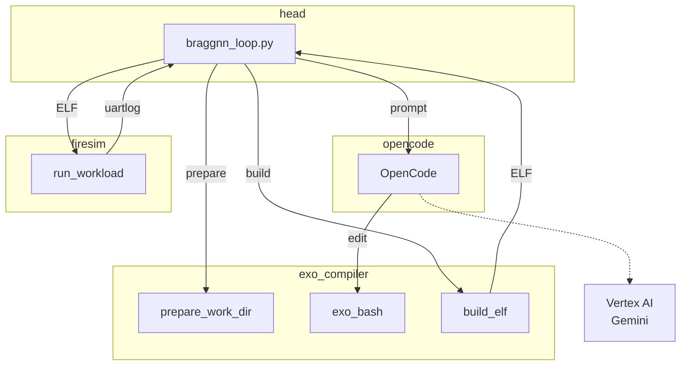
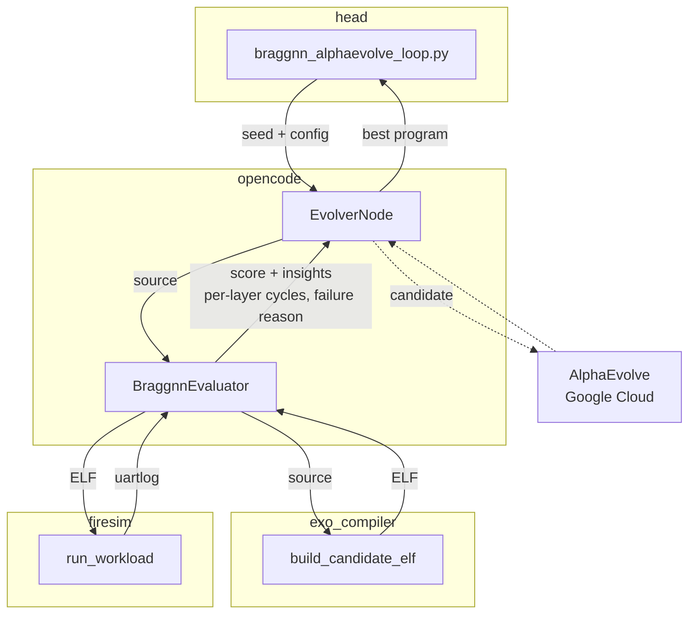
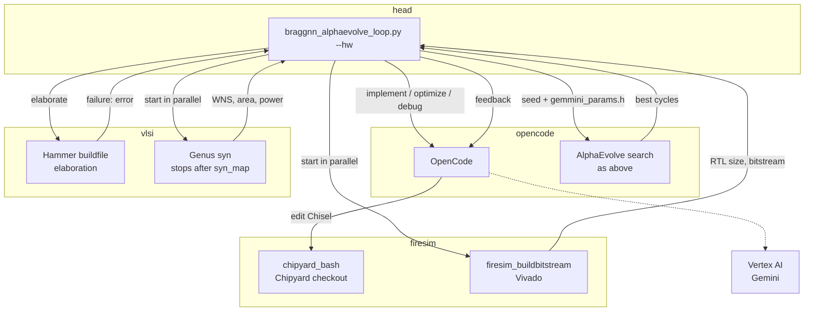

# chia-braggnn-workspace

Run everything, including job submission, on the head node. Copy `.env.example` to `.env` and fill in your cluster.

## Setup

Install uv (https://docs.astral.sh/uv/).
Some dependencies (evolve-flows, skydiscover) are private forks fetched over SSH (see `pyproject.toml`), so register an SSH key with GitHub.

```bash
git clone <repository URL> chia-braggnn-workspace
cd chia-braggnn-workspace
uv sync
```

## Submitting jobs

```bash
# Measure the baseline cycles
uv run chia job submit --address http://<head-ip>:8265 --working-dir . -- python chia/braggnn_loop.py --iterations 0

# Measure the fusion schedule
uv run chia job submit --address http://<head-ip>:8265 --working-dir . -- python chia/braggnn_loop.py --iterations 0 --schedule braggnn_schedule_fusion.py

# Measure the fast schedule (braggnn_tune_opus.c ported to Exo)
uv run chia job submit --address http://<head-ip>:8265 --working-dir . -- python chia/braggnn_loop.py --iterations 0 --schedule braggnn_schedule_fast.py

# LLM improvement loop
uv run chia job submit --address http://<head-ip>:8265 --working-dir . -- python chia/braggnn_loop.py

# AlphaEvolve search (settings in config_alphaevolve.yaml)
uv run chia job submit --address http://<head-ip>:8265 --working-dir . -- python chia/braggnn_alphaevolve_loop.py

# AlphaEvolve search on a bitstream from the co-design loop; pass that run's *_gemmini_params_attempt<N>.h
uv run chia job submit --address http://<head-ip>:8265 --working-dir . -- python chia/braggnn_alphaevolve_loop.py --gemmini-params-h <path> --max-iterations 50

# HW + SW co-design (Chisel edit -> Hammer elaboration / synthesis and bitstream build -> AlphaEvolve)
uv run chia job submit --address http://<head-ip>:8265 --working-dir . -- python chia/braggnn_alphaevolve_loop.py --hw --iterations 3

# Resume a --hw run after its last successful attempt (that attempt's Chisel must still be checked out)
uv run chia job submit --address http://<head-ip>:8265 --working-dir . -- python chia/braggnn_alphaevolve_loop.py --hw --iterations 3 --resume-from <run dir>
```

Output goes to `~/braggnn_loop_runs/<timestamp>/`; copy what you want to keep into `results/`.

## System

The search only rewrites `exo/braggnn_schedule.py`; the algorithm (`braggnn_reference.py`), the instr library (`gemmini.py`), the C harness (`braggnn_main.c`) and the hardware stay fixed.
Candidates can still add their own instrs with arbitrary Gemmini C. Since Exo cannot verify that C, the harness requires the int8 predictions to match the seed's exactly.
The harness also runs `braggnn_eval` a second time with a fence after every layer and prints per-layer cycles (`Layer <name>: <cycles>`). AlphaEvolve gets them as insights, and per-group speedups as extra metrics for Pareto sampling.
`braggnn_schedule_lowlevel.py` and `braggnn_schedule_fusion.py` are reference schedules.
`braggnn_schedule_fast.py` ports `braggnn_tune_opus.c` (add-gcp-cluster branch) to Exo with its own instrs (`gemmini_fast.py`). It is the target the search should reach by itself, so the search never sees either file.

| worker | host / docker | resource | role |
|---|---|---|---|
| head | `CHIA_HEAD_IP` | - | ray job driver (`braggnn_loop.py` / `braggnn_alphaevolve_loop.py`) |
| opencode | chia-evolver | `opencode_creds` 1 / `evolver` 1 | OpenCode (Gemini) and `EvolverNode`; one container plays both roles |
| exo_compiler | chia-exo | `exo_build` 8 | `chia/exo_compiler.py`: sets up the working directory, the LLM edits `braggnn_schedule.py` through a BashTool, builds the ELF with exocc + riscv64 gcc |
| firesim | `CHIA_FIRESIM_IP` | `FPGA` 1 / `manager` 1 | `chia/firesim.py`: runs on Alveo U250 / Rocket + Gemmini (`FireSimGemminiRocketConfig`), returns avg cycles and PASSED / FAILED |

### LLM loop (`braggnn_loop.py`)



### AlphaEvolve search (`braggnn_alphaevolve_loop.py`)



### HW + SW co-design (`braggnn_alphaevolve_loop.py --hw`)



## Results

Average cycles per patch over 10 patches on FireSim (Rocket + Gemmini, Alveo U250).
The original schedule (`exo/braggnn_schedule.py`) takes 45,170 cycles on the original RTL, with error (0.219, 0.151) px.

### `results/20260925_014209/` (HW + SW co-design, 3 iterations)

Each iteration: OpenCode (`gemini-3.8-flash`) edits Gemmini's Chisel, the bitstream and Genus synthesis (up to `syn_map`) build in parallel, then AlphaEvolve tries 10 candidates on the new hardware, starting from the previous best.
Iteration 1 comes from run `20260924_125151` (files in `from_20260924_125151/`); this run resumed from it.
File numbers start at 0: iteration 2 is `*_attempt3*`, iteration 3 is `*_attempt5*`. The other numbers never reached a bitstream.

| iteration | main HW changes (from the original RTL) | FPGA RTL | best cycles | WNS (ns) | cell area (mm²) | power (W) |
|---|---|---:|---:|---:|---:|---:|
| 1 | sp_banks 8, RS ld/st/ex 32/16/32, queues 16/8/16, in-flight 64, TLB 8 | - | 41,405 | -23.65 | 76.94 | 0.748 |
| 2 | 1 plus WS only, no training conv / max pool / dw conv, spad_read_delay 1 | 44.1 MB | 44,532 | -23.61 | 75.44 | 0.664 |
| 3 | 2 with spad_read_delay 4, RS st 8, queues 32/4/32, TLB 16 | 40.5 MB | **40,000** | -23.47 | 75.67 | 0.680 |

- Synthesis: sky130 (ss_100C_1v60), 20 ns target, no retiming, after `syn_map`; vectorless power; cell area excludes nets (85.01 / 82.56 / 82.89 mm² including them)
- Bitstreams took about 4 h (iteration 2) and 5 h (iteration 3, 1 h 41 min of it in Vivado's RTL elaboration). Vivado never finishes on RTL above ~50 MB, so the loop cancels those builds
- spad_read_delay 1 slowed iteration 2 down; the LLM reverted it to 4 in iteration 3
- The AlphaEvolve candidates only varied CPU-loop unrolling and never wrote an instr; in iteration 3 none beat the seed (40,000)
- The original schedule runs in 44,687 cycles on iteration 3's RTL, just 1.1% faster than on the original RTL

### `results/20260925_144709/` (SW-only AlphaEvolve, 50 candidates)

50 candidates on iteration 3's bitstream, starting from the original schedule (`--gemmini-params-h` = iteration 3's `gemmini_params_attempt5.h`, `--max-iterations 50`). This is the first run with custom instrs, the exact prediction check, per-layer cycles and Pareto sampling (probability 0.3).

| | avg cycles | vs. original schedule on original RTL |
|---|---:|---:|
| seed (`candidate_0001.py`) | 44,687 | 1.01x |
| best (`candidate_0043.py`, `*_best_braggnn_schedule.py`) | **37,569** | **1.20x** |

- 15.9% fewer cycles than the seed. Progress of the best: 44,687 → 43,194 (no NLB row tiling, one fence for qkv) → 40,125 (instr that loads the softmax input straight into the accumulator via a K = 0 resadd loop) → 39,351–38,261 (instr that runs 1x1 convs as `gemmini_loop_ws` matmuls) → 38,203 (CPU-loop unrolling) → 37,569
- 51 evaluations including the seed: 6 build failures, 2 rejected for changed predictions (both still within 0.5 px), and 31 of the 42 correct candidates repeating an earlier result (mostly the identical ELF)
- Compared with `braggnn_tune_opus.c`, the search found the direct softmax load and qkv as matmuls, but not the single load via the skip bit, input reuse with A = NULL, or dropping the flatten by permuting fc1's weights

Per-layer cycles from the fenced second run (`uartlog_seed_candidate_0001.txt`, `uartlog_best_candidate_0043.txt`; other candidates: `layer_profile` in `*_chia_eval_log_attempt0.jsonl`)

| layer | seed | best |
|---|---:|---:|
| input_quantize | 1,786 | 1,799 |
| conv1 | 3,177 | 3,173 |
| nlb_qkv | 6,643 | 5,464 |
| nlb_theta_phi | 3,124 | 2,905 |
| nlb_softmax | 9,764 | 5,150 |
| nlb_attention_g | 2,440 | 2,435 |
| nlb_out_conv | 2,941 | 2,757 |
| nlb_resadd | 1,679 | 1,687 |
| conv2 | 8,123 | 8,116 |
| conv3 | 1,554 | 1,555 |
| flatten_fc1 | 2,410 | 1,565 |
| fc2_to_output | 941 | 950 |

## Bringing up the cluster (do not do this)

Do not run `chia up` / `chia down`; with several people sharing the physical machines, it breaks the cluster.

```bash
./scripts/deploy.sh
```
