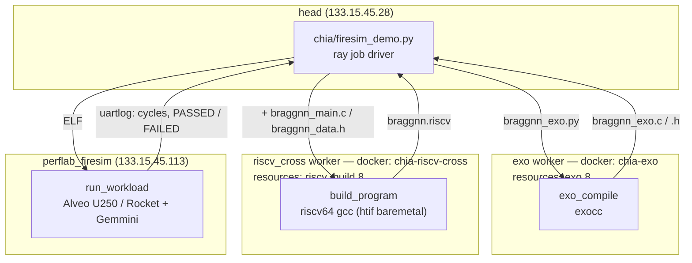

# chia-braggnn-workspace

いろいろと面倒なので、すべての操作（ジョブ投入含む）は `platinum.perf.cs.tut.ac.jp` 上で行ってください。

## 事前準備

事前に uv (https://docs.astral.sh/uv/) をインストールしておいてください。

ホームディレクトリ直下などにcloneします。

```bash
git clone https://github.com/ANL-TUT/chia-braggnn-workspace.git
cd chia-braggnn-workspace
uv sync
```

おしまい

## ジョブ投入

```bash
uv run chia job submit --address http://133.15.45.28:8265 --working-dir . python chia/firesim_demo.py
```

## システム構成


```mermaid
graph TD
    subgraph head["head (133.15.45.28)"]
        D["chia/firesim_demo.py<br/>ray job driver"]
    end

    subgraph exo["exo worker — docker: chia-exo<br/>resources: exo 8"]
        E["exo_compile<br/>exocc"]
    end

    subgraph cross["riscv_cross worker — docker: chia-riscv-cross<br/>resources: riscv_build 8"]
        R["build_program<br/>riscv64 gcc (htif baremetal)"]
    end

    subgraph fire["perflab_firesim (133.15.45.113)<br/>resources: firesim 1"]
        F["run_workload<br/>Alveo U250 / Rocket + Gemmini"]
    end

    D -->|braggnn_exo.py| E
    E -->|braggnn_exo.c / .h| D
    D -->|+ braggnn_main.c / braggnn_data.h| R
    R -->|braggnn.riscv| D
    D -->|ELF| F
    F -->|"uartlog: cycles, PASSED / FAILED"| D
```

## クラスタ立ち上げ（やらないでください）

`chia up` `chia down` は物理マシンに対して複数人がやるとめちゃくちゃになってしまうとおもうので、やらないでください。

```bash
./scripts/deploy.sh
```
