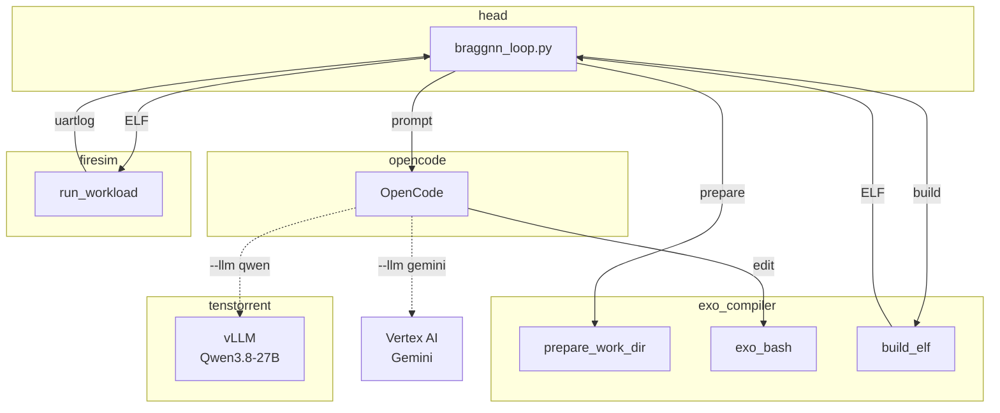

# chia-braggnn-workspace

いろいろと面倒なので、すべての操作（ジョブ投入含む）は `platinum.perf.cs.tut.ac.jp` 上で行ってください。

## 事前準備

事前に uv (https://docs.astral.sh/uv/) をインストールしておいてください。

ホームディレクトリ直下などにcloneします。

```bash
git clone https://github.com/ANL-TUT/chia-braggnn-workspace.git
cd chia-braggnn-workspace
uv sync
```

おしまい

## ジョブ投入

```bash
uv run chia job submit --address http://133.15.45.28:8265 --working-dir . -- python chia/braggnn_loop.py --iterations 5
```

## システム構成

LLM (OpenCode + Gemini / Qwen) で `exo/braggnn_exo.py` を最適化するループ


```mermaid
graph TD
    subgraph head[head]
        D[braggnn_loop.py]
    end

    subgraph llm[opencode]
        L[OpenCode]
    end

    V[Vertex AI<br/>Gemini]

    subgraph tt[tenstorrent]
        Q[vLLM<br/>Qwen3.8-27B]
    end

    L -.->|"--llm gemini"| V
    L -.->|"--llm qwen"| Q

    subgraph exo[exo_compiler]
        S[prepare_work_dir]
        B[exo_bash]
        E[build_elf]
    end

    subgraph fire[firesim]
        F[run_workload]
    end

    D -->|prepare| S
    D -->|prompt| L
    L -->|edit| B
    D -->|build| E
    E -->|ELF| D
    D -->|ELF| F
    F -->|uartlog| D
```

| worker | 場所 / docker | resource | 役割 |
|---|---|---|---|
| head | 133.15.45.28 | - | `chia/braggnn_loop.py`（ray job driver） |
| opencode | chia-opencode | `opencode_creds` 1 | OpenCode。`--llm gemini`（デフォルト）で Gemini (Vertex AI)、`--llm qwen` で tenstorrent 上の Qwen |
| exo_compiler | chia-exo | `exo_build` 8 | `chia/exo_compiler.py`: 作業ディレクトリ作成、BashTool で LLM が `braggnn_exo.py` を編集、exocc + riscv64 gcc で ELF ビルド |
| firesim | 133.15.45.113 | `firesim` 1 | `chia/firesim.py`: Alveo U250 / Rocket + Gemmini（`FireSimGemminiRocketConfig`）で実行、avg cycles と PASSED / FAILED を返す |
| tenstorrent（ray 外） | 133.15.45.6:8000 | - | Tenstorrent Wormhole 上の vLLM で `Qwen/Qwen3.8-27B` を OpenAI 互換 API として提供（`--llm qwen` のときだけ使用） |

## クラスタ立ち上げ（やらないでください）

`chia up` `chia down` は物理マシンに対して複数人がやるとめちゃくちゃになってしまうとおもうので、やらないでください。

```bash
./scripts/deploy.sh
```
