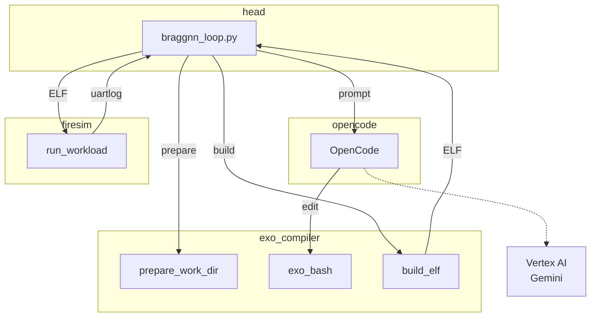
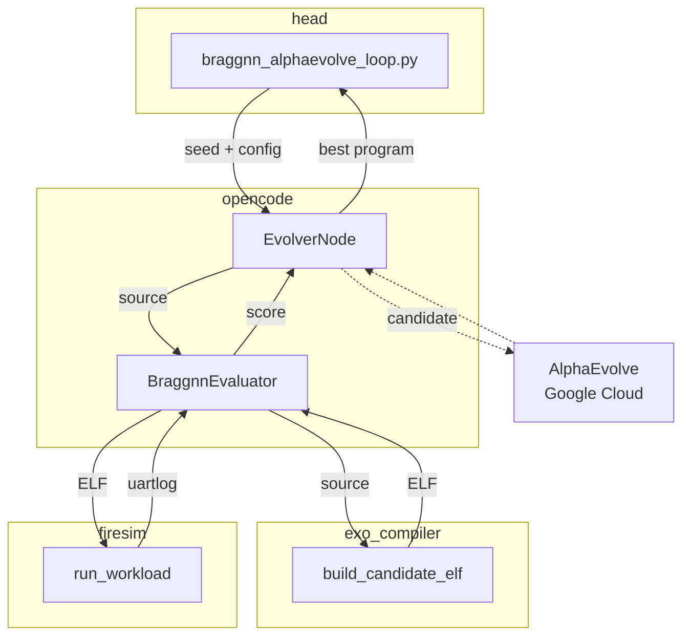

# chia-braggnn-workspace

いろいろと面倒なので、すべての操作（ジョブ投入含む）は `platinum.perf.cs.tut.ac.jp` 上で行ってください。

## 事前準備

事前に uv (https://docs.astral.sh/uv/) をインストールしておいてください。
依存の一部（evolve-flows, skydiscover）は ANL-TUT の private フォークを SSH で取ってくるので、GitHub に SSH 鍵を登録しておいてください。

適当な場所にcloneします。

```bash
git clone https://github.com/ANL-TUT/chia-braggnn-workspace.git
cd chia-braggnn-workspace
uv sync
```

おしまい

## ジョブ投入

```bash
# ベースラインのサイクル数計測
uv run chia job submit --address http://133.15.45.28:8265 --working-dir . -- python chia/braggnn_loop.py --iterations 0

# Fusion版（柳沼君作）のサイクル数計測
uv run chia job submit --address http://133.15.45.28:8265 --working-dir . -- python chia/braggnn_loop.py --iterations 0 --schedule braggnn_schedule_fusion.py

# 実際の改善ループ
uv run chia job submit --address http://133.15.45.28:8265 --working-dir . -- python chia/braggnn_loop.py

# AlphaEvolve 版（設定は config_alphaevolve.yaml）
uv run chia job submit --address http://133.15.45.28:8265 --working-dir . -- python chia/braggnn_alphaevolve_loop.py

# HW + SW co-design（Chisel 編集 → Hammer elaborate / syn と bitstream ビルド → AlphaEvolve）
uv run chia job submit --address http://133.15.45.28:8265 --working-dir . -- python chia/braggnn_alphaevolve_loop.py --hw --iterations 3

# RTL ループ（OpenCode の RTL 編集 → パラメータ調整。各ステップを Verilator で ISA 不変・出力 bit 一致・高速化の
# 3 条件で採否判定し、不採用は自動で巻き戻す → 採用があれば bitstream ビルド → AlphaEvolve → 結果を OpenCode へ）
# RTL 編集は反復開始時より --rtl-target（既定 10%）速くなるまで続け、OpenCode の費用が --rtl-budget-usd
# （既定 $30）に達するか --rtl-steps 回で打ち切ってその時点の設計で先へ進む。1 セッションは 40 ターンまで。
uv run chia job submit --address <ADDR> --working-dir . \
  --runtime-env-json '{"env_vars": {"RAY_JOB_STOP_WAIT_TIME_S": "120"}}' \
  -- python src/braggnn_alphaevolve_loop.py --rtl --iterations 2 --rtl-target 0.10 --rtl-budget-usd 30 --param-steps 2
```

どちらも結果は `~/braggnn_loop_runs/<timestamp>/`。残すものは `results/` にコピーしてコミット。

AlphaEvolve 版は、bitstream が mvout_spad（gemmini4xraymodels a7c2b9c 以降）に対応しているときだけ `--mvout-spad` を付ける。付けると `gemmini.py` の `st_acc_i8_act_spad*` を探索で使えるようになり、付けないとそれを使った候補はビルド前に弾かれる。

## システム構成

最適化するのは `exo/braggnn_schedule.py` だけ。アルゴリズム（`braggnn_reference.py`）、
Gemmini の instr（`gemmini.py`）、C ハーネス（`braggnn_main.c`）、ハードウェアは固定。
`braggnn_schedule_lowlevel.py` と `braggnn_schedule_fusion.py` は参照用の別スケジュール。

| worker | 場所 / docker | resource | 役割 |
|---|---|---|---|
| head | 133.15.45.28 | - | ray job driver（`braggnn_loop.py` / `braggnn_alphaevolve_loop.py`） |
| opencode | chia-evolver | `opencode_creds` 1 / `evolver` 1 | OpenCode（Gemini）と `EvolverNode`。同じコンテナが両方の役をもつ |
| exo_compiler | chia-exo | `exo_build` 8 | `chia/exo_compiler.py`: 作業ディレクトリ作成、BashTool で LLM が `braggnn_schedule.py` を編集、exocc + riscv64 gcc で ELF ビルド |
| firesim | 133.15.45.113 | `FPGA` 1 / `manager` 1 | `chia/firesim.py`: Alveo U250 / Rocket + Gemmini（`FireSimGemminiRocketConfig`）で実行、avg cycles と PASSED / FAILED を返す |

### LLM ループ（`braggnn_loop.py`）


```mermaid
graph TD
    subgraph head[head]
        D[braggnn_loop.py]
    end

    subgraph llm[opencode]
        L[OpenCode]
    end

    V[Vertex AI<br/>Gemini]

    L -.-> V

    subgraph exo[exo_compiler]
        S[prepare_work_dir]
        B[exo_bash]
        E[build_elf]
    end

    subgraph fire[firesim]
        F[run_workload]
    end

    D -->|prepare| S
    D -->|prompt| L
    L -->|edit| B
    D -->|build| E
    E -->|ELF| D
    D -->|ELF| F
    F -->|uartlog| D
```

### AlphaEvolve 探索（`braggnn_alphaevolve_loop.py`）


```mermaid
graph TD
    subgraph head2[head]
        D2[braggnn_alphaevolve_loop.py]
    end

    subgraph ev[opencode]
        N[EvolverNode]
        EV[BraggnnEvaluator]
    end

    A[AlphaEvolve<br/>Google Cloud]

    N -.->|candidate| A
    A -.-> N

    subgraph exo2[exo_compiler]
        C[build_candidate_elf]
    end

    subgraph fire2[firesim]
        F2[run_workload]
    end

    D2 -->|seed + config| N
    N -->|source| EV
    EV -->|source| C
    C -->|ELF| EV
    EV -->|ELF| F2
    F2 -->|uartlog| EV
    EV -->|score| N
    N -->|best program| D2
```

## 結果

### `results/20260922_171212/`

`--iterations 5`（`gemini-3.8-flash`）での実行結果。FireSim（Rocket + Gemmini）上で 10 パッチ推論したときの 1 パッチあたり平均サイクル数と、予測誤差の平均で評価（誤差の許容値は 0.5 px）。ベースラインは `exo/braggnn_schedule.py` そのままで、全レイヤが既に Gemmini にオフロードされている状態。

| iter | stage | 結果 | avg cycles | 高速化率 | avg error (px) | 備考 |
|---|---|---|---:|---:|---|---|
| 00 | firesim | PASSED | 45,170 | 1.00x | (0.219, 0.151) | ベースライン |
| 01 | firesim | PASSED | 40,853 | 1.11x | (0.219, 0.151) | new best |
| 02 | firesim | PASSED | 48,626 | 0.93x | (0.219, 0.151) | 悪化 |
| 03 | firesim | PASSED | **39,875** | **1.13x** | (0.219, 0.151) | new best（最終 best） |
| 04 | firesim | PASSED | 41,206 | 1.10x | (0.219, 0.151) | best 更新なし |
| 05 | firesim | PASSED | 45,716 | 0.99x | (0.219, 0.151) | best 更新なし |

- 最終 best は iter_03（`best_braggnn_schedule.py` は `iter_03/braggnn_schedule.py` と同じ中身）
- 全イテレーションで avg error が完全に一致しているのは、Exo のスケジューリングが等価性を保証していて数値結果が変わらないため。この探索で動くのはサイクル数だけ
- OpenCode セッションは 5 回分、合計 618 ターン、約 $12.96
- 主な最適化（LLM 自身の説明より）
  - iter_01: 小さい FC 層（fc3 / fc4 / fc_output）を Gemmini から CPU に戻して完全展開（Gemmini 起動 3 回・RoCC config 18 命令・DMA 往復・fence 3 回を削減）。入力量子化と NCHW flatten のループ展開と順序入れ替え。NLB の theta / phi / g 間の fence を 1 つに集約
  - iter_02: `NLB_ROW_TILE = 8` による `divide_loop` をやめて matmul_theta_phi / nlb_softmax を 1 回の `gemmini_loop_ws` に統合。fc2 も CPU に移動。量子化 / flatten を完全展開 → **悪化（48,626）**
  - iter_03: 連続する Gemmini 演算の間の fence を 6 か所削除（conv1→NLB、theta_phi→softmax、attention_g→nlb_out、conv2→conv3、fc1→fc2）。CPU→Gemmini 境界（conv3 の後、fc2 の後）の fence は保持。iter_02 の変更は採らず iter_01 ベース
  - iter_04: NLB 内の残り 3 か所（nlb_qkv_conv #2 の後、nlb_softmax の後、resadd_relu の後）の fence も削除 → **悪化（41,206）**
  - iter_05: `schedule_eval` で `fp32_patch` / `pred` を `DRAM_STATIC` に移して計測区間内の `free()` を除去。1 反復しかない `i1_o` ループを展開 → **悪化（45,716）**
- fence 削除は iter_03 の 6 か所までは効いたが、iter_04 でさらに削ると逆に悪化している。ベースラインからの改善幅は 11.7%（45,170 → 39,875）

#### best（iter_03）のパッチごとの誤差

`iter_03/log.txt` の値。太字は 0.5 px を超えているもの。

| patch | cycles | err x (px) | err y (px) |
|---:|---:|---:|---:|
| 0 | 44,744 | -0.344 | **0.636** |
| 1 | 39,452 | 0.191 | -0.001 |
| 2 | 39,352 | 0.466 | -0.011 |
| 3 | 39,306 | 0.022 | 0.354 |
| 4 | 39,361 | 0.276 | -0.219 |
| 5 | 39,301 | **-0.777** | 0.034 |
| 6 | 39,330 | -0.026 | 0.014 |
| 7 | 39,264 | 0.001 | 0.022 |
| 8 | 39,361 | 0.044 | 0.162 |
| 9 | 39,286 | -0.039 | 0.061 |
| 平均（絶対値） | 39,875 | 0.219 | 0.151 |

- ログの `Avg error` は絶対値の平均
- patch 0 だけ 44,744 cycles と 5,400 ほど多い。i-cache / データのコールドスタート分
- 誤差はスケジュールに依存しない（ベースラインと同じ値）ので、この探索では精度は悪化しない

### `results/20260922_225440/`（AlphaEvolve）

`config_alphaevolve.yaml`（候補 10 個）での実行結果。スコアは seed（45,170 cycles）に対する高速化率。

| 結果 | 件数 | avg cycles | 高速化率 |
|---|---:|---:|---:|
| ビルド失敗 | 5 | - | - |
| 成功（best: `candidate_0007.py`） | 1 | **39,850** | **1.13x** |
| 成功 | 2 | 41,564 | 1.09x |
| 成功 | 1 | 89,214 | 0.51x |

- サーバ側が seed を予算に数えるため候補は 9 個しか来ず、ジョブは途中で止めた。現在はサーバ側の予算を `max_iterations + 1` にして修正済み
- best は fence を conv3 と fc_output の後だけに減らし、NLB の matmul / softmax の行分割をやめて 1 回の呼び出しにまとめ、CPU 側のループを展開したもの
- 成功した候補の誤差（x, y の大きい方）は全て 0.219 で seed と同じ

## クラスタ立ち上げ（やらないでください）

`chia up` `chia down` は物理マシンに対して複数人がやるとめちゃくちゃになってしまうとおもうので、やらないでください。

```bash
./scripts/deploy.sh
```

## GCP 構成（`cluster_gcp.yaml`）の注意：FireSim ノード上の OpenCode ツールに届かない

ラップトップを head にして GCP の VM と FireSim ノードを tailnet でつなぐ構成では、
OpenCode（GCP VM 上の opencode コンテナ）から FireSim ノード上の `chipyard_bash`（MCP ツール）に接続できない。
opencode のログ（コンテナ内の `~/.local/share/opencode/log/`）に次の警告が出て、ツールなしでモデルが動く。
LLM 呼び出しは `empty response` や `Requests ending with a model turn are not supported` で失敗する。

```
level=WARN message="server unavailable" key=chipyard_bash type=remote status=failed
```

### 原因

```
 ① FireSim 実行・Verilator・ビルド（Ray タスク）：届く
 ドライバ / evaluator ──gRPC──▶ CONNECT proxy ──tailnet──▶ 100.120.29.63:<Ray port>
                                                            Ray は 0.0.0.0 で待受 ✔

 ② OpenCode → chipyard_bash（Ray の外の HTTP）：届かない
 opencode CLI (GCP VM) ── http://127.0.0.2:24016 ──▶ GCP VM の chia relay
     ──SOCKS/tailnet──▶ FireSim ノードの 100.120.29.63:24016
                          ✘ 誰も待受していない（chipyard_bash は 127.0.0.2:24016 だけ）
```

- Ray（raylet / worker）は `0.0.0.0` で待ち受けるので、tailnet の IP 宛てでも届く。
- ChiaTool（MCP）はノードの advertise IP（FireSim ノードでは `127.0.0.2`）だけで待ち受ける。
  chia は tailnet 経由で届いた接続を `127.0.0.1` で受けて advertise IP に渡す bridge を用意するが、
  それは chia が userspace tailscaled を動かすノードの前提。
- FireSim ノードは自前のカーネルモード tailscale（`tailscale0` = `100.120.29.63`）なので、
  接続が tailnet の IP にそのまま届き、最後の区間がない。
- オンプレの `cluster.yaml` は tailnet を使わず実 IP でつなぐので、この問題は起きない。

### 回避策（FireSim ノードで実行）

tailnet の IP で受けた接続を、ツールのアドレスに転送する中継を、ツール用ポート範囲の全体に張る。

```bash
# ツール用ポート範囲と advertise IP を確認（例: 24016〜24026, 127.0.0.2）
cat /proc/$(pgrep -f raylet | head -1)/environ | tr '\0' '\n' \
  | grep -E 'CHIA_TOOL_(BASE_PORT|MAX_PORT|ADVERTISE_HOST)='

# その範囲の全ポートに中継を張る（socat がなければ先にインストール）
for p in $(seq 24016 24026); do
  nohup socat TCP-LISTEN:$p,bind=100.120.29.63,fork,reuseaddr TCP:127.0.0.2:$p >/dev/null 2>&1 &
done
ss -ltn | grep -c "100.120.29.63:240[12][0-9]"   # 張ったポート数（例では 11）
```

確認：ループで OpenCode のステップが動いている間に、GCP VM から次を実行し `000` 以外が返れば届いている。

```bash
curl -s -m5 -o /dev/null -w '%{http_code}\n' http://127.0.0.2:24016/
```

- 手動で張った中継なので、FireSim ノードの再起動や `chia up` のやり直しで消える。
  ポート範囲が変わることもあるので、そのたびに範囲を確認して張り直す。
- 恒久対策は chia 側の修正（自前 tailscale のノードでも tailnet IP → advertise IP の bridge を置く、
  またはツールを `0.0.0.0` で待ち受けさせる）。
