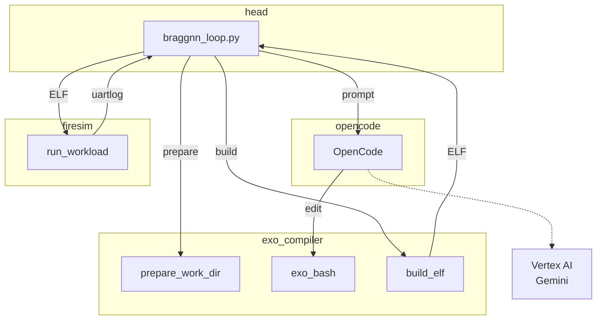

# chia-braggnn-workspace

いろいろと面倒なので、すべての操作（ジョブ投入含む）は `platinum.perf.cs.tut.ac.jp` 上で行ってください。

## 事前準備

事前に uv (https://docs.astral.sh/uv/) をインストールしておいてください。

ホームディレクトリ直下などにcloneします。

```bash
git clone https://github.com/ANL-TUT/chia-braggnn-workspace.git
cd chia-braggnn-workspace
uv sync
```

おしまい

## ジョブ投入

```bash
uv run chia job submit --address http://133.15.45.28:8265 --working-dir . -- python chia/braggnn_loop.py --iterations 5
```

## システム構成

LLM (OpenCode + Gemini) で `exo/braggnn_exo.py` を最適化するループ


```mermaid
graph TD
    subgraph head[head]
        D[braggnn_loop.py]
    end

    subgraph llm[opencode]
        L[OpenCode]
    end

    V[Vertex AI<br/>Gemini]

    L -.-> V

    subgraph exo[exo_compiler]
        S[prepare_work_dir]
        B[exo_bash]
        E[build_elf]
    end

    subgraph fire[firesim]
        F[run_workload]
    end

    D -->|prepare| S
    D -->|prompt| L
    L -->|edit| B
    D -->|build| E
    E -->|ELF| D
    D -->|ELF| F
    F -->|uartlog| D
```

| worker | 場所 / docker | resource | 役割 |
|---|---|---|---|
| head | 133.15.45.28 | - | `chia/braggnn_loop.py`（ray job driver） |
| opencode | chia-opencode | `opencode_creds` 1 | OpenCode。Gemini (Vertex AI) を使用 |
| exo_compiler | chia-exo | `exo_build` 8 | `chia/exo_compiler.py`: 作業ディレクトリ作成、BashTool で LLM が `braggnn_exo.py` を編集、exocc + riscv64 gcc で ELF ビルド |
| firesim | 133.15.45.113 | `firesim` 1 | `chia/firesim.py`: Alveo U250 / Rocket + Gemmini（`FireSimGemminiRocketConfig`）で実行、avg cycles と PASSED / FAILED を返す |

## 結果

### `results/20260913_152111/`

`--iterations 5`（`gemini-3.8-flash`）での実行結果。FireSim（Rocket + Gemmini）上で 10 パッチ推論したときの 1 パッチあたり平均サイクル数と、予測誤差の平均で評価（誤差の許容値は 0.5 px）。

| iter | stage | 結果 | avg cycles | 高速化率 | avg error (px) | 備考 |
|---|---|---|---:|---:|---|---|
| 00 | firesim | PASSED | 25,056,479 | 1.00x | (0.205, 0.196) | ベースライン（`exo/braggnn_exo.py` そのまま） |
| 01 | firesim | PASSED | 4,964,578 | 5.05x | (0.210, 0.183) | new best |
| 02 | llm | 失敗 | - | - | - | LLM の応答なし（`no reply`） |
| 03 | firesim | PASSED | 3,074,242 | 8.15x | (0.478, 0.231) | new best |
| 04 | firesim | PASSED | 3,107,555 | 8.06x | (0.452, 0.205) | best 更新なし |
| 05 | firesim | PASSED | **3,073,496** | **8.15x** | (0.460, 0.231) | new best（最終 best） |

- 最終 best は iter_05（`best_braggnn_exo.py` は `iter_05/braggnn_exo.py` と同じ中身）。exocc で C にしたものは `best_c/`（`braggnn_exo.c` / `.h` / `.d`）に置いている
- OpenCode セッションは 4 回分（iter_01, 03, 04, 05）で、合計 462 ターン、約 $9.46
- 主な最適化
  - iter_01: NLB の 1x1 conv（theta / phi / g / out）と `matmul_transA` / `matmul_transB` を Gemmini にオフロード。Gemmini バッファの確保を `lift_alloc` でプロシージャ先頭に移動。CPU 側の conv1 / conv3 / leaky / resadd はループ展開
  - iter_03: conv2 / conv3 / NLB conv の重み転置と、matmul の行列転置を最内ループの外に移動（1 回だけ前もって実行）。conv1 は入力パッチをまとめて読み込むようにした。leaky / FC / softmax のループ展開をさらに広げた
  - iter_04: 転置ループの順序を入れ替えてメモリへの書き込みを連続にした。requant とバイアス初期化を 8 要素ずつ展開。conv1 は `ow` を 3 ずつタイリング
  - iter_05: conv1 で出力チャネル 8 本を 1 回のループ反復で計算するようにした。matmul の requant、NLB の reshape、入力の量子化、flatten をすべて展開
- 注意: iter_01 から iter_03 にかけてサイクル数は約 40% 減ったが、x 方向の誤差が 0.21 px から 0.46〜0.48 px に増えていて、許容値 0.5 px のすぐ手前まで来ている

#### best（iter_05）のパッチごとの誤差

`iter_05/log.txt` の値。太字は 0.5 px を超えているもの。

| patch | cycles | err x (px) | err y (px) |
|---:|---:|---:|---:|
| 0 | 3,147,258 | **-0.691** | **0.636** |
| 1 | 3,088,145 | **-0.502** | -0.174 |
| 2 | 3,083,333 | -0.400 | -0.184 |
| 3 | 3,068,753 | -0.152 | 0.180 |
| 4 | 3,058,620 | -0.331 | -0.479 |
| 5 | 3,078,877 | **-0.691** | -0.140 |
| 6 | 3,050,966 | -0.459 | -0.159 |
| 7 | 3,047,020 | -0.346 | -0.151 |
| 8 | 3,048,881 | -0.389 | -0.012 |
| 9 | 3,063,110 | **-0.645** | -0.199 |
| 平均（絶対値） | 3,073,496 | 0.460 | 0.231 |

- ログの `Avg error` は絶対値の平均
- x の誤差は 10 パッチすべてマイナス（符号付きの平均は -0.461 px）で、どのパッチも同じ方向にずれている
- 許容値 0.5 px は平均に対する判定なので PASSED だが、パッチ単位では patch 0・1・5・9 の x と patch 0 の y が 0.5 px を超えている

## クラスタ立ち上げ（やらないでください）

`chia up` `chia down` は物理マシンに対して複数人がやるとめちゃくちゃになってしまうとおもうので、やらないでください。

```bash
./scripts/deploy.sh
```
